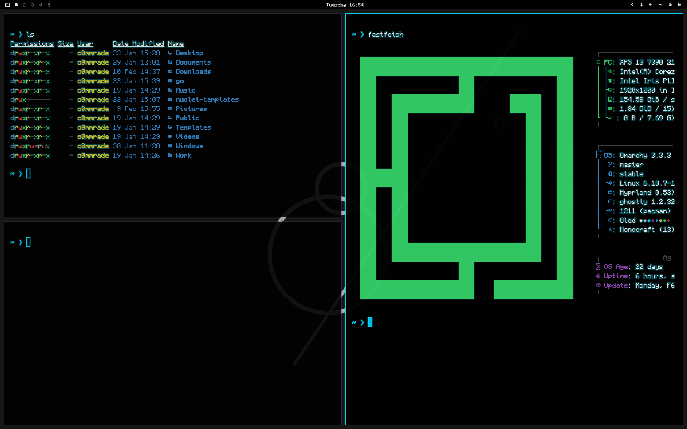

# OLED — True Black Theme for Omarchy

A high-contrast OLED dark theme for [Omarchy](https://omarchy.com). True black backgrounds, crisp pixel aesthetics, and cyan accents.



## Install

```bash
omarchy-theme-install https://github.com/thec0mmrade/omarchy-oled
omarchy-theme-set oled
```

## Palette

| Role          | Hex       | Preview |
|---------------|-----------|---------|
| Background    | `#000000` |  |
| Foreground    | `#E8E8E8` |  |
| Accent/Cyan   | `#00D4FF` |  |
| Selection BG  | `#00D4FF` |  |

### Terminal Colors

| Normal | Hex | Bright | Hex |
|--------|-----|--------|-----|
| Black  | `#000000` | Bright Black | `#404040` |
| Red    | `#CC3333` | Bright Red   | `#FF4444` |
| Green  | `#33CC66` | Bright Green | `#44FF77` |
| Yellow | `#CCCC33` | Bright Yellow| `#FFFF44` |
| Blue   | `#3388CC` | Bright Blue  | `#44AAFF` |
| Magenta| `#8844AA` | Bright Magenta| `#AA66CC` |
| Cyan   | `#00D4FF` | Bright Cyan  | `#44FFFF` |
| White  | `#C0C0C0` | Bright White | `#E8E8E8` |

## Extras

Optional enhancements installed separately:

```bash
./extras/setup-oled-extras.sh
```

The script detects the active variant (`oled` or `oled-light`) and adjusts automatically:

- **Monocraft Nerd Font** — Minecraft-inspired chunky pixel font
- **Ghostty glow shader** — Subtle cyan bloom around bright text (dark variant only; replaces any existing shaders)
- **GTK4 overrides** — Installs the correct dark or light libadwaita overrides for Nautilus and other GTK4 apps

**Re-run this script after switching between dark and light variants.**

### Light Variant

A complete light theme (white background, dark cyan accent) is included:

```bash
cp -r extras/oled-light ~/.config/omarchy/themes/oled-light
omarchy-theme-set oled-light
./extras/setup-oled-extras.sh
```

## Uninstalling Extras

```bash
rm ~/.local/share/fonts/Monocraft-nerd-fonts-patched.ttc && fc-cache -f
omarchy-font-set <your-preferred-font>
rm ~/.config/ghostty/oled-glow.glsl
rm ~/.config/gtk-4.0/gtk.css
```

Remove from `~/.config/ghostty/config`:
```
custom-shader = ~/.config/ghostty/oled-glow.glsl
custom-shader-animation = false
```

## License

MIT
